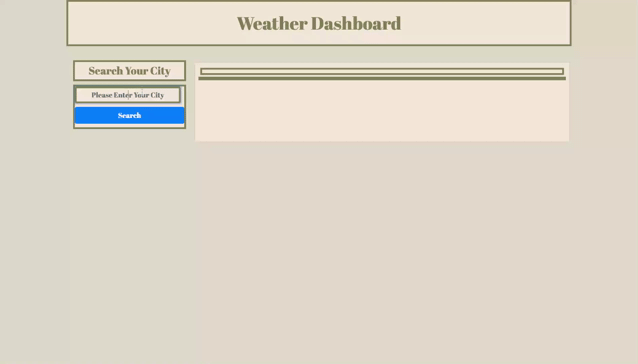

# Weather Dashboard

## Description

- Deployed webpage is a Weather Dashboarfd which allows the user to search for a city to access the current weather conditions as well as a five day forecast.

## Technologies Used

- HTML
- CSS
- JavaScript
- Bootstrap
- OpenWeather API

## Behavior

- WHEN user search for a city in the form THEN user am provided with the current and next five days for that city THEN the city is added to the search history as well as Local Storage

- WHEN juser check current weather conditions for the searched city THEN user is provided with the city name, the date, an icon representing the weather conditions, the temperature in imperial units, the humidity, and the UV index.

- WHEN shown the UV index THEN the user is presented with a color to match the index conditions.

- WHEN user check the five day forecast conditions for the searched city THEN user is provided with the city name, the date, an icon representing the weather conditions, the temperature in imperial units, the humidity, and the UV index.

- WHEN the user clicks the city in the search history THEN the user is presenter again with the current and future forecast for that city

## Gif of Dashboard

## Author

- Rachel Haddad

## Links

- Here is the Repo: [https://github.com/buttercupsmom/hw-6];
- Here is the Page: []
